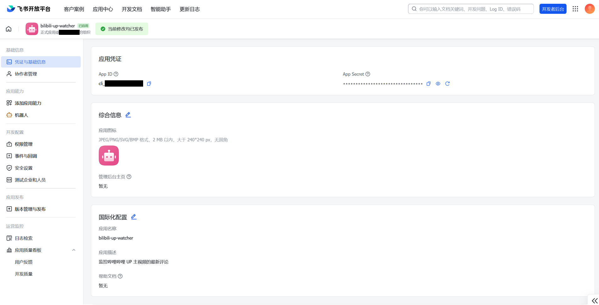
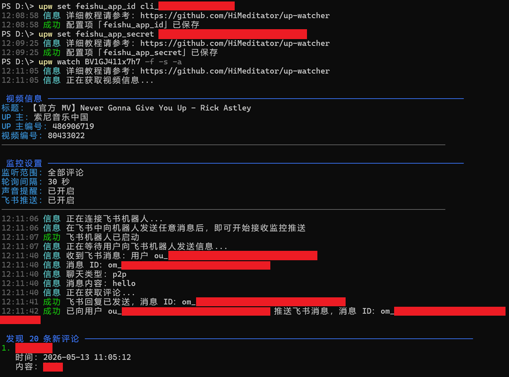

# 飞书机器人配置与使用指南

## 创建机器人

参考以下链接文档，完成飞书机器人的权限配置（权限与文档中保持一致即可，无需额外权限）。

https://open.feishu.cn/document/develop-an-echo-bot/faq

发布成功后，飞书账号会收到如下消息：


## 配置密钥

在刚才创建机器人的页面，点击 `凭证与基础信息` Tab，即可看到应用的 `App ID` 与 `App Secret`



运行以下命令，将 `App ID` 与 `App Secret` 写入配置文件：

```bash
upw set feishu_app_id "<app_id>"
upw set feishu_app_secret "<app_secret>"
```

## 使用机器人

首先启动监控，注意添加 `-f` 参数，表示使启用飞书机器人推送新评论，示例：

```
upw watch BV1GJ411x7h7 -f -s -a
```

然后打开飞书，向机器人发送任意消息，即可开始接收推送。


